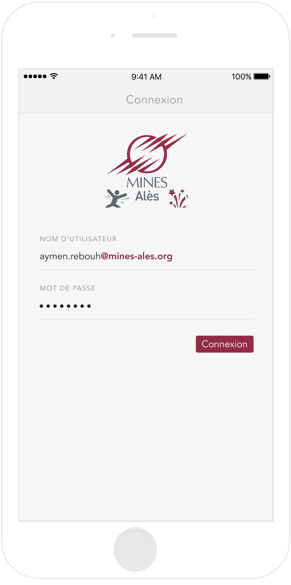
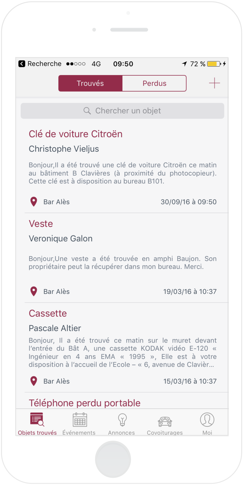
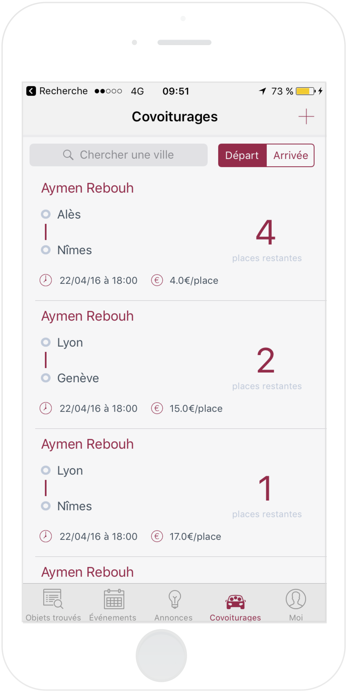

# MinesAlesCommunity

⚠️ This project doesn't work with the last version of Xcode and Swift, but you can take a look at the code.

For one week, we, me and four others students, developed an iOS and web application for our school community. 

Because of a lot of emails from students of different kind, such as car sharing, lost objects, sales, etc.. we decided to 
create an iOS and web app for our school students ( more or less 1000 students ) whichi allow people to find everything 
they are looking for in one organized app.

Author ( iOS app and design )

Rebouh Aymen, aymenworks@gmail.com

Twitter @aymenworks

